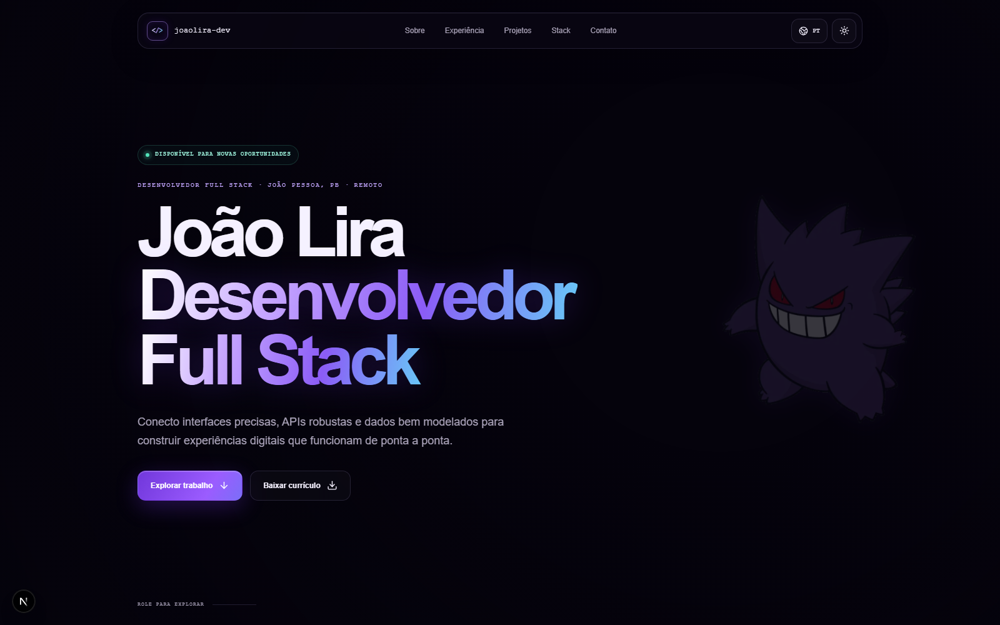

# Portfólio — João Victor Lira

Portfólio pessoal de João Victor Lira, desenvolvedor Full Stack e estudante de
Ciência da Computação. A página reúne experiência profissional, formação,
tecnologias, projetos selecionados e canais de contato em uma experiência
responsiva, bilíngue e com identidade visual inspirada no espaço.

## Prévia



## Destaques

- interface responsiva para desktop, tablet e celular;
- conteúdo em português e inglês;
- temas escuro e claro;
- background 3D interativo com movimento por cursor;
- animações de entrada e microinterações;
- currículo disponível para download;
- formulário de contato integrado ao cliente de e-mail;
- metadados de SEO, Open Graph e Twitter;
- favicon e mascote personalizados;
- respeito à preferência de movimento reduzido.


## Tecnologias

- Next.js 16 com App Router;
- React 19 e TypeScript;
- Three.js para a experiência 3D;
- Tailwind CSS 4 como base de estilos;
- CSS responsivo e animações nativas;
- Lucide React para ícones;
- ESLint e TypeScript para qualidade de código.

## Executando localmente

### Requisitos

- Node.js 22.13 ou superior;
- npm.

### Instalação

```bash
git clone https://github.com/joaolira-dev/portfolio-v2.git
cd portfolio-v2
npm install
npm run dev
```

Abra [http://localhost:3000](http://localhost:3000) no navegador.

O projeto não depende de banco de dados nem exige variáveis de ambiente para
funcionar.

## Scripts

```bash
npm run dev        # inicia o ambiente de desenvolvimento
npm run lint       # executa a análise estática
npm run typecheck  # valida os tipos TypeScript
npm run build      # gera o build otimizado de produção
npm run start      # executa o build de produção
npm test           # roda lint, typecheck e build
```

## Estrutura

```text
portfolio-v2/
├── app/
│   ├── Background3D.tsx  # cena 3D e parallax do background
│   ├── Portfolio.tsx     # conteúdo e componentes da página
│   ├── globals.css       # identidade visual e responsividade
│   ├── layout.tsx        # metadados e estrutura global
│   └── page.tsx          # rota principal
├── docs/
│   └── portfolio-preview.png
├── public/
│   ├── projects/         # imagens dos projetos selecionados
│   ├── profile.png
│   ├── og.png
│   └── joaolira-curriculo.pdf
├── next.config.ts
└── package.json
```


## Contato

- GitHub: [@joaolira-dev](https://github.com/joaolira-dev)
- LinkedIn: [joaolira-dev](https://www.linkedin.com/in/joaolira-dev)
- E-mail: [joaoliradev@hotmail.com](mailto:joaoliradev@hotmail.com)

Desenvolvido por João Victor Lira.
