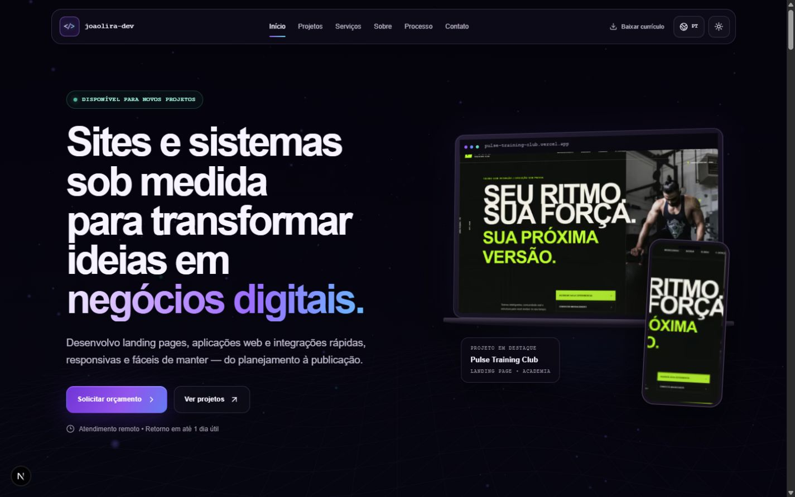

# Portfólio — João Lira

Portfólio comercial de João Lira, desenvolvedor full-stack focado em landing pages, sites institucionais, sistemas web, APIs e integrações. A experiência foi construída para apresentar serviços, trabalhos selecionados e experiência profissional, transformando visitas em contatos para novos projetos.

## Prévia



## Principais recursos

- proposta profissional objetiva na primeira tela;
- projetos com navegação horizontal controlada pela rolagem no desktop e no celular;
- Hard Skills e Soft Skills apresentadas em blocos separados;
- apresentação minimalista de quatro serviços de desenvolvimento web;
- projetos organizados como estudos de caso acessíveis em modal;
- trajetória profissional com tecnologias e responsabilidades reais;
- formulário validado que prepara uma mensagem completa no WhatsApp;
- navegação fixa com indicação da seção ativa e menu móvel acessível;
- conteúdo em português e inglês;
- fundo abstrato leve, responsivo ao cursor e compatível com movimento reduzido;
- imagens abaixo da primeira tela com carregamento sob demanda;
- SEO, Open Graph, dados estruturados e favicon configurados.

## Tecnologias

- Next.js 16 com App Router;
- React 19 e TypeScript;
- CSS responsivo com animações nativas;
- Tailwind CSS 4 como base do projeto;
- Lucide React e ícones vetoriais locais;
- ESLint e TypeScript para qualidade de código.

## Executando localmente

Requisitos: Node.js 22.13 ou superior e npm.

```bash
git clone https://github.com/joaolira-dev/portfolio-v2.git
cd portfolio-v2
npm install
npm run dev
```

Abra [http://localhost:3000](http://localhost:3000). O projeto não exige banco de dados nem variáveis de ambiente.

## Scripts

```bash
npm run dev        # inicia o ambiente de desenvolvimento
npm run lint       # executa a análise estática
npm run typecheck  # valida os tipos TypeScript
npm run build      # gera o build de produção
npm run start      # executa o build de produção
npm test           # executa lint, typecheck e build
```

## Estrutura principal

```text
portfolio-v2/
├── app/
│   ├── Background3D.tsx      # fundo espacial e parallax
│   ├── BrandIcons.tsx        # ícones de redes sociais
│   ├── CaseStudyModal.tsx    # estudo de caso acessível
│   ├── Portfolio.tsx         # página e interações principais
│   ├── portfolio-content.ts  # serviços e projetos
│   ├── cinematic.css         # direção visual e responsividade atuais
│   ├── globals.css           # estilos globais e componentes auxiliares
│   ├── layout.tsx            # metadados e dados estruturados
│   └── page.tsx              # rota inicial
├── docs/
│   └── portfolio-preview.png
├── public/
│   ├── projects/             # imagens WebP dos projetos
│   ├── profile.webp
│   ├── og.png
│   └── joaolira-curriculo.pdf
├── next.config.ts
└── package.json
```

## Contato

- GitHub: [@joaolira-dev](https://github.com/joaolira-dev)
- LinkedIn: [joaolira-dev](https://www.linkedin.com/in/joaolira-dev)
- E-mail: [joaoliradev@hotmail.com](mailto:joaoliradev@hotmail.com)
